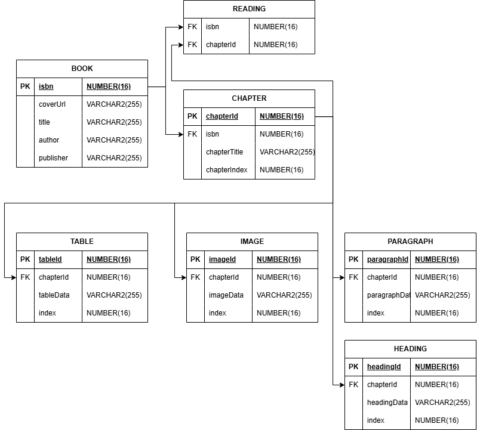

# Table and Unit Test Report

## Table Explanation

The database is divided into seven tables:

### Book Table
The book table contains the book's ISBN as the primary key. It then has non-nullable fields for the cover image's URL (coverUrl), the title, the author, and the publisher

### Chapter Table
The chapter table contains a unique, auto-generated chapterId for each book which serves as the table's primary key. It then contains a foreign key being the book it belongs to's ISBN. It additionally has a field called chapterIndex which allows the program to know the order of chapters in the book. It lastly has a field which corresponds to the title of the chapter if applicable.

### Paragraph, Image, Table, and Heading tables
These tables all share a similar format. They have a unique identifier (paragraphId, imageId, tableId, headingId respectively) and a field containing their data (paragraphData, imageData, tableData, and headingData respectively). They additionally all have a foreign key of chapterId which associates them to the chapter they belong to. From there the tables also have an index field which allows the program to know the order that the elements are in.

The idea of having these four tables formatted similarly is to allow them to be easily selected as a group and ordered by index. This then lets the application then iterate over them and place the contents of each chapter in the correct order.

### Reading Table
The reading table contains two foreign keys, one for the Book's ISBN and the other for the chapter's ID at which the reader left off. This will allow the database to track at what chapter the user stopped reading so they can resume seamlessly.


## SQL Statements to use tables

### Insert Statements (To add a book to the database for the first time):

Adds Book to database:
```sql
INSERT INTO book (isbn, coverUrl, title, author, publisher)
	VALUES (9780380007011, 'https://covers.image.png', 'A Woman of No Importance', 'Oscar Wilde', 'British Books')
```

Adds chapters to book: (chapterId is auto-generated)
```sql
INSERT INTO chapter (isbn, chapterTitle, chapterIndex)
	VALUES (9780380007011, 'Act 1', 1)

INSERT INTO chapter (isbn, chapterTitle, chapterIndex)
	VALUES (9780380007011, 'Act 2', 2)

INSERT INTO chapter (isbn, chapterTitle, chapterIndex)
	VALUES (9780380007011, 'Act 3', 3)
```

Add paragraph, images, headings, and tables to chapter as needed (each of these tables has an auto-generated id field as their primary key). Also note the index field and how each table must increment the same index.
```sql
INSERT INTO heading (chapterId, headingData, index)
	VALUES (000001, "The Terrace at Hunstanton Chase", 1)

INSERT INTO paragraph (chapterId, paragraphData, index)
	VALUES (000001, "[Sir John and Lady Caroline Pontefract, Miss Worsley, on chairs under large yew tree.]", 2)

INSERT INTO paragraph (chapterId, paragraphData, index)
	VALUES (000001, "Lady Caroline.  I believe this is the first English country house you have stayed at, Miss Worsley?", 3)

INSERT INTO paragraph (chapterId, paragraphData, index)
	VALUES (000001, "Hester.  Yes, Lady Caroline.", 4)

...

INSERT INTO image (chapterId, imageData, index)
	VALUES (000001, "https://website.ballroom.png", 95)

...

INSERT INTO table (chapterId, tableData, index)
	VALUES (000001, '<table>....</table>', 137)

...

INSERT INTO paragraph (chapterId, paragraphData, index)
	VALUES (000003, "Mrs. Arbuthnot.  [Turning round.]  Oh! no one.  No one in particular.  A man of no importance.", 113)

INSERT INTO heading (chapterId, headingData, index)
	VALUES (000003, "Curtain", 114)
```

When the user exits the reader, log what chapter they left off at:
```sql
INSERT INTO reading (isbn, chapterId)
	VALUES (9780380007011, 000002)
```

### Selects Statements (To display books):

Get list of all available (parsed) book objects:
```sql
SELECT * FROM book
```

Get list of chapters from selected book:
```sql
SELECT * FROM chapter c
INNER JOIN book b ON b.isbn = c.isbn
WHERE b.isbn = 9780380007011
```

Retrieve all elements of selected chapter:
```sql
SELECT tableData AS data, index, chapterId FROM table
WHERE chapterId = 000003
UNION SELECT imageData AS data, index, chapterId FROM image
WHERE chapterId = 000003
UNION SELECT paragraphData AS data, index, chapterId FROM paragraph
WHERE chapterId = 000003
UNION SELECT headingData AS data, index, chapterId FROM heading
WHERE chapterId = 000003
ORDER BY 2 ASC;
```



# Unit test Planning

## Automated testing strategy for Unit Testing
* To ensure the viewmodel works properly, the HomeScreenUiTest will make sure the Viewmodel components work properly
* The setup method will create the HomeScreen and the viewModel
* Then each section of the home screen will be tested to see if it exists or not
* This will be done through the use of onNodeWithText
* The library screen will also be tested to ensure the viewmodel works for multiple screens
* The library screen will also use onNodeWithText to check if the components exist or not
* There will also be a test to check if the Reading shelf works
* Overall, by testing every component of multiple screens, the viewmodel will be thoroughly tested
* The Unzip, download file, and create directory will also be tested to ensure that the process of downloading a file works properly

## Automated testing strategy for Instrumentation Testing
* To ensure each navigation component gets tested properly, a separate test class will be created. 
* The test classes will be ran using the AndroidJUnit4 package.
 * The setup for each test class will set the nav controller for the View model and Navigation host. 
* It will also initialize the Navigation host, which will also be used to set the correct Navigation Component.
 * The Permanent navigation component takes a unit method as a parameter, so an empty lambda expression will be used to define that. 
* Each test class will include 5 test methods, which will check if the navigation works for each page.
